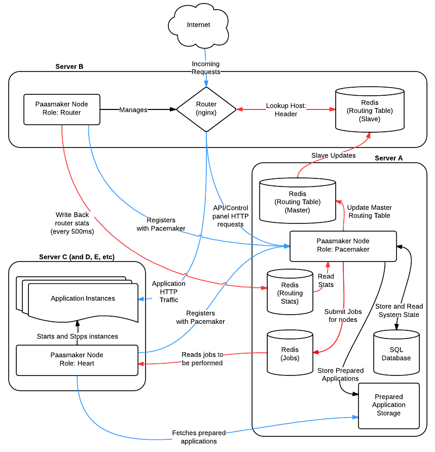

Overview of Paasmaker Clusters
==============================

Paasmaker was designed from the very beginning to be run on a cluster
of machines, to be able to scale up.

Diagram
-------

If you were to seperate Paasmaker out as much as possible with the current
setup, you would end up with a setup something like this:

Blue lines signify HTTP, and red lines signify Redis. Black lines cover
anything else.

There is nothing preventing you from running all the components on a single
node, nor is there anything preventing you from coming up with any other
arrangement that suits your infrastructure. The only limitation currently
is that you can only have once Pacemaker node. We hope to fix this in a
future release of Paasmaker.

Paasmaker manages what it can
-----------------------------

With the default configuration, Paasmaker will start and stop it's own
instances of Redis and Nginx. In doing this, it can set up the correct
configuration for these daemons based on where you have everything
installed, and removes the need for manually wiring all the components
together.

Additionally, this means Paasmaker can generally work alongside other
applications or systems on existing servers if needed.

Paasmaker can be manually configured to use your own Redis or Nginx
installations if required.

.. note::
	Paasmaker actually uses the `OpenResty <http://openresty.org>`_
	Nginx distribution, as it contains all the relevant Lua patches
	to make the router work. If you want to use pure Nginx, you will
	need to patch it with a few modules to get it to work.

Dealing with Failure
--------------------

If the Pacemaker is unavailable, all other nodes are set up to assume
that nothing has changed, and they will continue to function exactly as
they have been left. When the pacemaker becomes available again, they
will catch up with anything that was left undone - in the case of Hearts,
they will report in instances that have stopped running, and in the case
of routers, they will catch up on any stats missed.

This design decision assumes that you will fix your Pacemaker if it fails,
but gives you the flexibility to have some time to do so if the repairs
are complex for any reason. It also allows you to upgrade nodes with very
little or no application downtime. (Some care must be taken obviously to
prevent any downtime).

The pacemaker node keeps a track of the last time it has heard from
heart nodes, and after a configurable timeout, will consider that node
dead and organise to replace all it's application instances on other
servers. Currently this timeout is quite high (120 seconds) but you
can tune this for your environment.

Server A
--------

In the diagram, server A is the master node. It contains several Redis
instances that are key to the whole system.

One of them is the master routing table Redis. Redis was chosen to host
the routing table because of it's fast lookups. In the future we plan
to use the embedded Lua scripting to enhance the features offered by
the router.

Another is the Job system Redis. Paasmaker has a distributed jobs system
which uses Redis to store job metadata, and also uses Redis's pubsub
features to notify other nodes of the status of jobs during execution.

The last Redis is for the router stats. This was chosen because it is
very fast to tally up the stats inside the Redis instance, which is how
the real time router traffic stats works.

The Pacemaker currently uses an SQL database to store the state of the
system - that is, the current applications and instances, as far as it
is aware of them. Currently, this SQL database must be on the same node
as the Pacemaker.

Server B
--------

In the diagram, server B serves as a router only. It starts up it's own
Redis instance, which is set up to be a slave of the master routing table.
In this fashion, if the master node goes away for a short time, this node
can continue to route traffic.

The actual routing is done with Nginx, with an embedded Lua script that
checks with the Redis instance to figure out what hostnames go to what
instances, and what route to that instance it should use.

Nginx can't unfortunately write stats directly back into the stats
Redis. Technically, this is because the log phase of Nginx Lua scripts
can't open TCP sockets and thus can't connect to the Redis server.

So, to report back stats, Nginx is configured to log requests to a second
access log, which is configured to output lines in a JSON format. The Paasmaker
router component running on that node will read this file regularly
(every 500ms by default), and update the stats Redis with any new
log lines. It tries to be as efficient as it can in parsing and
reading the log files to keep the overhead down. It is not expected that
this component will scale to very large levels in it's current form.
The log reader also tracks where it was in the log file and will catch
up if the Python component is shutdown for a short time.

You can have multiple router nodes for redundancy or scale. Each one
will have it's own slave Redis for the routing table. Alternately, you
can combine routers and heart nodes for simplicity on small clusters.

Server C (and D, E, etc)
------------------------

In the diagram, servers C onwards are known as "Heart" nodes. They run
the actual user applications on them. When instructed by a Pacemaker
node, they will fetch the application's code, unpack it, perform
any startup tasks, and then start the application. They then monitor
that application in case it fails or exits.

If an application instance fails, this is reported back to the Pacemaker
so it can take appropriate action. The hearts will not make any decisions
for themselves, and rely on the Pacemaker to do this for them.

The intention is that you might have quite a few heart nodes to run
your applications, to meet the scale required.

Paasmaker attempts to intelligently figure out where to place application
instances based on what it knows about the hearts. Hearts report in a self
generated score which is used to rank nodes. Also, if you request two instances
of an application, Paasmaker will always split this across two nodes if two
or more nodes are available, and the same applies for any other quantity
of instances.

Heart nodes can have tags, which are intended to be used to match applications
with specific requirements to nodes that are best able to serve that application.
The tags are generated by plugins, and are merged with tags configured by the
system administrator of the node. For example, a heart node on EC2 can report
its region as a tag (dynamically) and an application could then hint to Paasmaker
that it wants to run on nodes in a specific region.