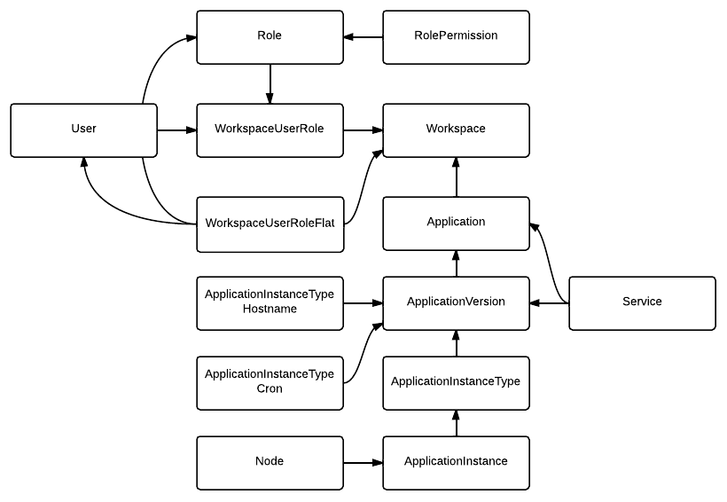

Database Models
=================

The database components are handled via the SQLAlchemy library.

The documentation below shows the model classes built in to Paasmaker,
and covers any special methods that they provide.

Diagramatically, the models look like this:

Base Class
----------

.. autoclass:: paasmaker.model.OrmBase
    :members:

Models
------

.. autoclass:: paasmaker.model.Node
    :members:

.. autoclass:: paasmaker.model.User
    :members:

.. autoclass:: paasmaker.model.Role
    :members:

.. autoclass:: paasmaker.model.RolePermission
    :members:

.. autoclass:: paasmaker.model.Workspace
    :members:

.. autoclass:: paasmaker.model.WorkspaceUserRole
    :members:

.. autoclass:: paasmaker.model.WorkspaceUserRoleFlat
    :members:

.. autoclass:: paasmaker.model.Application
    :members:

.. autoclass:: paasmaker.model.ApplicationVersion
    :members:

.. autoclass:: paasmaker.model.ApplicationInstanceType
    :members:

.. autoclass:: paasmaker.model.ApplicationInstance
    :members:

.. autoclass:: paasmaker.model.ApplicationInstanceTypeHostname
    :members:

.. autoclass:: paasmaker.model.ApplicationInstanceTypeCron
    :members:

.. autoclass:: paasmaker.model.Service
    :members:

Helpers
-------

.. autoclass:: paasmaker.model.WorkspaceUserRoleFlatCache
    :members:

Migrations
----------

Database migrations are handled with Alembic. To create a migration, make your changes
to the models, and then run the following command:

.. code-block:: bash

    $ alembic revision --autogenerate -m "Description of your change here"

You should then adjust the generated file as required. To apply pending migrations, use
this command:

.. code-block:: bash

    $ alembic upgrade head

Once you've applied your migration successfully, you can check in the new migrations version
file.

We are still working out the workflow for applying database migrations.