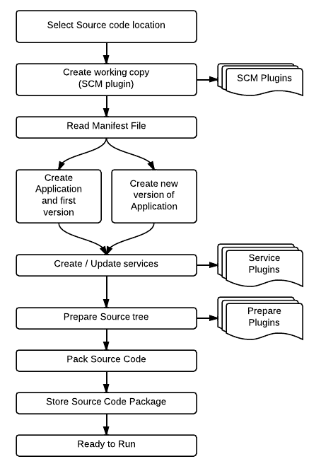
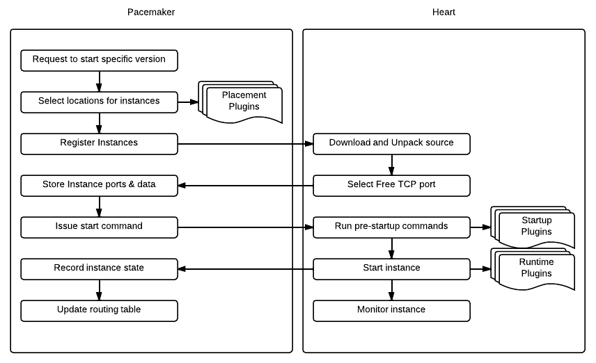
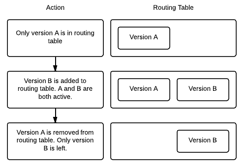

Concepts
========

Before you delve into Paasmaker, we would like to introduce a few concepts.
There are quite a few here, but these are core to understanding Paasmaker.

Runtime
	A runtime is the language that your application is written in. Paasmaker
	uses the runtime name to figure out what plugin to use to
	start, stop, and manage that particular language. Runtimes
	also have different versions as well - for example, Ruby applications
	often are written to target a specific version of Ruby, and Paasmaker
	will often have several versions available.

Hostname
	Paasmaker uses the term hostname to mean the final domain name that
	maps to a particular application. For example, 'foobar.com' is a hostname.
	It only ever contains the domain name part of the URL.

Service
	A service is some kind of resource that your application will use to do
	what it needs to do. Paasmaker is designed to manage these services for you,
	and just provide your application with the details it needs to interface with
	the service.

	For example, a service might be a MySQL database. Paasmaker will create this
	database for you, and supply you with the username, password, database name,
	hostname, and port for you to connect to.

	Applications give services a symbolic name when they are defined for their own
	use. All versions of that application share the same named services.
	Other applications do not share the same services.

	Services are based on plugins, so Paasmaker is able to provide your application
	with many different things. However, each Paasmaker cluster is configured
	to offer only specific services, so you may not be able to access any
	service on any cluster. Paasmaker will inform you if a service is not
	available.

Routing Table
	Once Paasmaker starts your application, it needs to map hostnames to
	applications. It stores a routing table to match the hostnames to applications,
	and the routers use this to choose the correct location to send traffic.

Workspace
	A workspace is a container that you can place multiple applications into.
	There are many ways to use workspaces, but the intended use is to
	have a development, staging, and production workspace, which applications
	can detect and behave slightly differently.

Application
	An application is a collection of versions, and instance types. It is identified
	by a symbolic name. The application name is unique per workspace.

	For example, you might have an application with the name 'foobar.com', which
	then contains several versions.

	Normally, your application would map to a single code base, although that
	code base might contain several sub components (see instance types below).

Application Manifest
	Each application requires a manifest file - typically called ``manifest.yml``,
	in the root of your codebase. It's just a plain text file, in `YAML <http://www.yaml.org/>`_
	format. It's expected that it will live in some kind of source control system,
	and be version controlled via that system.

Application Version
	For each application, you will have at least one, but likely several, versions.
	Each version is a new deployment of your code, expected to line up with a specific
	revision in your source control system. At any time, you can start up any version
	that Paasmaker knows about and view it, depending on your exact application.

	You can have several versions of an application running at a time.

	Each application version has a set of services that it requires, and that are
	supplied to the application instances.

Current Version
	Several versions of an application can be running at a time, but only one
	of those is the current version. When you give your instance types hostnames,
	these point only to the current version of the application. All other versions
	have unique generated names that can be used to view them.

Instance Type
	This is also called a "version type", or "application version type" in some
	places in the documentation.

	Each instance type is a subcomponent of your code from the same codebase,
	that can have it's own hostnames and way of running.

	For example, in a PHP project, you might have the following directories:

	* ``web/`` - your public facing website document root (for example, that
	  is for ``foobar.com`` and ``www.foobar.com``)
	* ``admin/`` - a publically accessable admin area for your website, protected
	  by a username and password of some kind. This might respond to ``admin.foobar.com``.

	In this case, you would configure two instance types for your application,
	with different document roots and hostnames. A single instance (see below)
	will only ever do one of these instance types at a time.

	Each instance type can have the following:

	* Its own seperate runtime (language).
	* Its own hostnames.
	* Its own cron tasks.
	* Its own startup commands.

	Instance types have a few other flags as well that change how they operate - see
	Standalone and Exclusive instance types below.

Instance
	An instance is a copy of your code, on a server, running a specific instance
	type. Paasmaker will deploy instances of your application to servers as configured,
	or to meet demand.

	You can hint to Paasmaker about where to put your applications, but ultimately it
	is up to Paasmaker to decide where to put your application.

	If an instance fails, a new instance (with a brand new copy of the code)
	will be started up to replace it, to meet the number of required instances for
	your application.

	If you request multiple instances, by default Paasmaker will attempt to distribute these
	across the machines available (and avoid duplicates on a single server if possible).
	So you need to be aware that the filesystem is not shared between these instances.

Standalone Instance Type
	Standalone instances are those that do not listen for HTTP requests, but are a task
	that run in the background. They are expected to start and stay running whilst that
	version is running. For example, you might have a front end web request handler
	that pushes long running tasks onto a queue. A standalone instance running in the background,
	that is part of your code, can wait and process entries from that queue as they are
	submitted. You would configure this as an additional instance type on your application
	that is able to start this task.

Exclusive Instance Type
	Exclusive instances are those that only run when a version is current. For example,
	you might have a standalone instance that runs in the background to process entries
	in a queue. But you might not want two different versions running at the same
	time and processing the same queue, because your application might rely on only one
	running.

	If you mark your instance as exclusive, Paasmaker will arrange to start and stop
	the instances such that only the current version is running. Also note that
	Paasmaker does a "break before make" in this case - this means it will shut down the
	existing exclusive instance first before starting the new one up, which may result in
	dropped traffic if the instance is serving HTTP requests. Exclusive instance types
	are not designed for instances that serve HTTP traffic, but Paasmaker does not stop
	you from doing this.

.. _user-application-lifecycle:

Following an Application lifecycle
----------------------------------

To assist with understanding how Paasmaker works, the following describes what Paasmaker
will do to go from having the raw source code, to executing your application.

To keep this example simple, we'll assume the following configuration:

* An application named 'foobar.com'.
* An application with a single instance type, 'web'.
* An application using the Ruby runtime.

The prepare stage looks as follows:

#. When you specify where the source code is, Paasmaker will make itself a working copy of that
   source code. For example, if you reference a git repository, it will clone that repository
   to a location, and work on those files.
#. Paasmaker then looks for a manifest file. By default this is called ``manifest.yml`` and
   is expected to be in the root of the files. You can supply a different name when you create
   a version, which allows you to have multiple manifest files per codebase.
#. Paasmaker reads the manifest file. Based on the manifest file, it will create a new application,
   or create a version of an existing application. It also starts to create the services that you
   need, and move onto the prepare phase.
#. The manifest file can specify a series of prepare commands. These are plugin based, but the
   default plugin will simply run a series of shell commands against the code base. This is
   designed for your application to get things ready from a pristine checkout.

   For example, a modern Symfony2 PHP application will use composer to download any
   dependencies, which are generally not checked into source control, and thus not available
   to Paasmaker. If you configure Paasmaker to fetch these during the prepare phase, then instances
   won't need to fetch these files on startup.

   Other things you can do with prepare commands might be compiling production assets (if you
   are using an asset pipeline of some kind), or building Java source files into a WAR file
   for later execution. Anything you can do with shell commands can be coded into these
   prepare commands, and for anything more complicated, it is possible to write a plugin for.
#. Once the application source tree is prepared, it is packed up. By default it will pack into
   a tar.gz file.
#. Paasmaker then stores the .tar.gz file somewhere ready for other servers to fetch it.
#. Your application is now ready to run.

Then, to run your application, Paasmaker takes the following steps:

#. A user indicates that they want to start a specific version of the application.
#. Paasmaker uses the hints you've supplied to select some servers to run your application.
   The result of this is a set of instances, one per instance type, up to the quantity you
   have requested.
#. Each of the selected servers are contacted to ask them to 'register' the instance. Registration
   means that the server fetches a copy of the code and unpacks it to a directory ready to run.
#. As part of registration, the server chooses a TCP port that the instance should use when it
   starts, and records that port for later use.
#. Once the instance is registered, the server can start running that application.
#. Each instance first has it's startup commands run - these are given in the manifest file.
   These are plugin based, but the most common one just runs shell commands against the codebase
   to get it ready. At this stage you might precompile assets if you need to do it just before
   starting up. The startup commands respect the runtime you've selected - so for example,
   if you're using Ruby, it will choose the correct version of Ruby to run your commands with.
#. Once these complete successfully, the instance is considered started. Paasmaker uses your selected
   runtime to start up the application. Standard applications are expected to listen on a TCP
   port for HTTP requests. Each runtime has a different strategy for running your application
   as appropriate, and switching between language versions.
#. Once your application starts listening for HTTP requests, it is considered running.
#. Once it is running, Paasmaker updates the routing table with the appropriate hostnames,
   so as to be able to route traffic to your application.

   If your application has hostnames, they only route to the current version of your application.
   Paasmaker will also generate a default hostname per version so you can access any version, and
   insert that into the routing table. You can use this to test a new version of your application
   before making it current.

.. _user-application-lifecycle-routing-switchover:

Once you decide that your application is ready to become the current version, you can use the
"Make Current" feature of Paasmaker. For simplicity, below we refer to **A** as the currently active
version, and **B** as the new version that you want to be active. Paasmaker then takes the following
actions:

#. The routing table is updated such that for each hostname that your application has, it will route
   to any active instances of both **A** and **B** at the same time.

   For this short time, both versions of your application will receive public traffic. This is
   to make sure that no public traffic is lost during the changeover. If Paasmaker removed **A**
   first, you would lose traffic because it would not know where to route requests until it
   had added **B**. This changeover is generally quite fast, but not instant.
#. The routing table is updated to remove **A** from all the hostnames that your application has.
   **A** continues to run, but is not receiving traffic.

When you are done with a version, you can stop the version. This will shutdown any instances
that are running, freeing up some resources on the servers. When an instance is stopped, the
server won't delete the instance files. You need to deregister the version to get the
servers to delete the instance files.

Cron tasks
----------

Paasmaker is able to run tasks periodically in a fashion similar to cron. However, traditional
cron tasks are shell commands that are run.

Paasmaker has decided to support web-crons instead. In your manifest file, you can specify
a series of tasks to run. You specify the times that they run in `cron style syntax
<http://en.wikipedia.org/wiki/Cron#CRON_expression>`_. You then specify a URI - that is,
a URI on your instance type - that is called at the appropriate times. Your URI will then
do what it needs to do.

The output of the cron task will be written to a log file so you can audit it later to make
sure it ran correctly.

Each instance type can have its own set of cron tasks.

You will note that the URI will be publically accessable. This is correct; Paasmaker will not
block that URI from being accessed from the general internet. There are a few ways to handle this:

* Paasmaker can supply a HTTP basic authentication username and password, that you specify
  in your manifest file.
* You can include a token in your URI. For example, make your cron URI something like
  ``/crons/task?token=<super long hard to guess string>``, and not perform the cron
  task if the token does not match. This is `security by obscurity <http://en.wikipedia.org/wiki/Security_through_obscurity>`_
  but will often meet the security requirements of many applications.

Database Migrations
-------------------

Often when updating your application, you will need to perform database migrations
or updates to match the newer version.

Paasmaker currently does not have a system for managing this, as every application and
framework handles migrations in its own way. Also, Paasmaker does not want to impose
a specific system on application developers, although in the future we hope we can
come up with a system that handles most use cases (although nothing will ever handle
all use cases).

For the time being, we suggest putting database migrations in your startup commands.
See the Ruby examples for how to hook this up for Ruby on Rails applications. When
doing this, you will need to carefully keep in mind how your migration affects
existing running versions of your application.

.. note::
	If your startup commands are running migrations, and you start up several instances
	at the same time, they will all try to run the migrations, and may either step
	on each other, or one may cause the other instances to fail to migrate correctly.
	One way to handle this is to only start one instance when you know you have
	a moderately sized migration, and then start up the remainder instances once the
	first instance is started.

Fetching configuration and metadata
-----------------------------------

Paasmaker supplies applications with their configuration data via environment variables.
This is a common approach for PaaS systems, as virtually every programming environment
allows you to fetch environment variables. Furthermore, the data in the environment
variables is JSON encoded, but all modern environments have a way to parse JSON.

For languages that Paasmaker supports, we publish interface classes that can automatically
detect and load these environment variables, falling back to configuration files to
fill in missing values for external development purposes.

The following environment variables are exposed to applications:

PM_METATATA
	The PM_METADATA environment variable contains additional information about
	your application. It's not core to interfacing with Paasmaker and is purely
	informational.

	For example, the contents of the PM_METADATA will look as so. All the keys
	shown here will appear for your application. In future, more keys may be
	passed to your application.

	.. code-block:: json

		{
		    "application": {
		        "application_id": 5,
		        "name": "tornado-advanced",
		        "version": 1,
		        "version_id": 7,
		        "workspace": "Test",
		        "workspace_stub": "test"
		    },
		    "node": {
		    	"key": "value",
		    },
		    "workspace": {
		        "key": "value"
		    }
		}

	The ``node`` and ``workspace`` keys are arbitrary data structures, that are
	set up on the nodes and the workspaces. The idea is to use tags in here to
	alter how your application runs to better suit your environment.

	For example, you might look at the node tags and detect that your application
	is running in a specific geographic location, and should use certain resources
	instead of others.

	Alternately, the workspace tags can be used to split between development,
	staging, and production. For example, the Ruby interface looks for a tag
	called ``RAILS_ENV``, and will use that as the Rails environment. This allows
	you to have a staging and production workspace on the same set of servers,
	with the exact same manifest configuration.

PM_SERVICES
	This environment variable lists your application services and the credentials
	required to access them. It will list all the services available to your
	application, and it's up to you to use the details that you require. It
	does not impose any limits on the number of services of each type that
	are exposed to an application, but each name is unique.

	For example, if you have a single MySQL service assigned, and called it
	``foobar-com-mysql`` in the application manifest, your application might
	have a structure as such:

	.. code-block:: json

		{
		    "foobar-com-mysql": {
		    	"protocol": "mysql",
		    	"database": "foobarcoc06753a5",
		    	"username": "foobarcoc06753a5",
		    	"hostname": "localhost",
		    	"port": 42801,
		        "provider": "paasmaker.service.mysql"
		    }
		}

	You will note that the actual database name contains some unique characters;
	some services will do this to make sure that multiple applications don't
	conflict with each other.

	Using this environment variable, you can find out the credentials your
	application should use.

PM_PORT
	This environment variable contains the TCP port that your instance
	should be listening on. You can use it to listen on the correct port.
	If you instance is standalone, it is not allocated a port, and this
	environment variable will not be present.